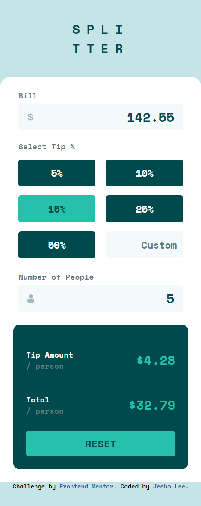
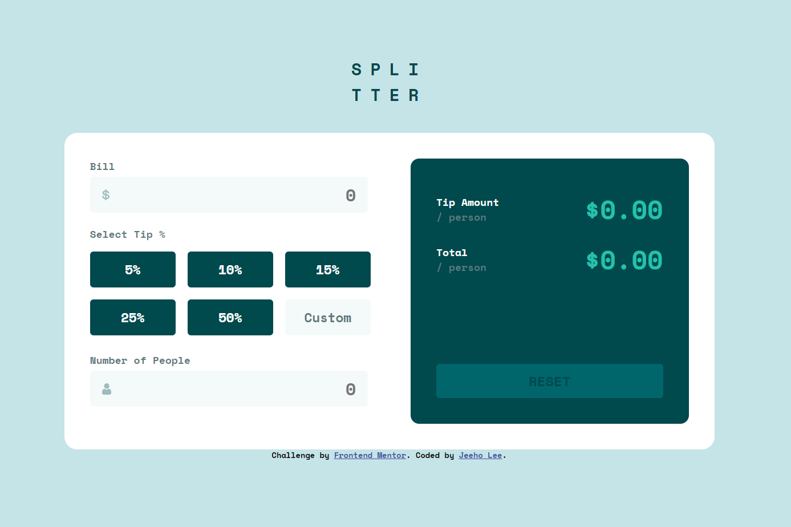
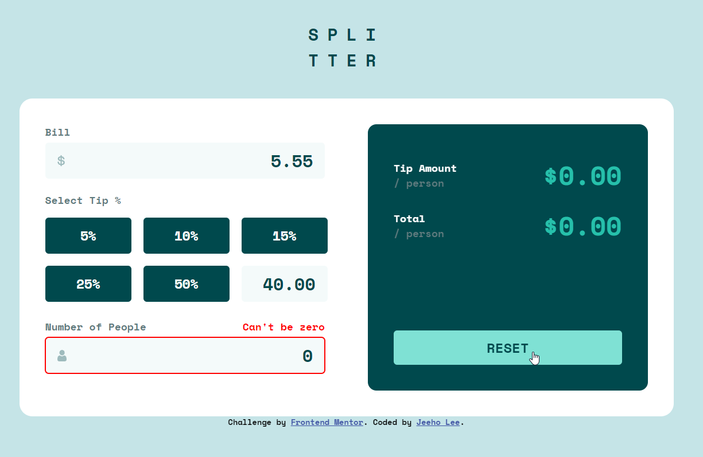
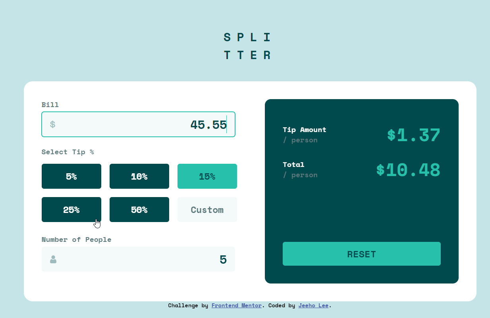

# Frontend Mentor - Tip calculator app solution

This is a solution to the [Tip calculator app challenge on Frontend Mentor](https://www.frontendmentor.io/challenges/tip-calculator-app-ugJNGbJUX). Frontend Mentor challenges help you improve your coding skills by building realistic projects.

## Table of contents

- [Overview](#overview)
  - [The challenge](#the-challenge)
  - [Screenshot](#screenshot)
  - [Links](#links)
- [My process](#my-process)
  - [Built with](#built-with)
  - [What I learned](#what-i-learned)
  - [Continued development](#continued-development)
  - [Useful resources](#useful-resources)
- [Author](#author)

## Overview

### The challenge

Users should be able to:

- View the optimal layout for the app depending on their device's screen size
- See hover states for all interactive elements on the page
- Calculate the correct tip and total cost of the bill per person

### Screenshot

### Links

- Solution URL: [https://github.com/jeeheezy/FEM-Tip-Calculator-App](https://github.com/jeeheezy/FEM-Tip-Calculator-App)
- Live Site URL: [https://jeeheezy.github.io/FEM-Tip-Calculator-App/](https://jeeheezy.github.io/FEM-Tip-Calculator-App/)

## My process

### Built with

- Semantic HTML5 markup
- CSS custom properties
- Flexbox
- CSS Grid
- Mobile-first workflow
- Vanilla Javascript

### What I learned

This project reminded me of some points of Javascript that I had to be mindful of, like using a for loop instead of a forEach if I'm planning on breaking out of the loop, or declaring event.preventDefault when doing input validation to not get double inputs.

The input validation probably made the project a bit more challenging than it needed to be. Instead of simply having a simple input field to enter in the number of people or the bill amount, I wanted a system any monetary values entered would automatically have two decimal points listed, similar to how QuickPay by Zelle works. In addition to manipulating the inputs to add in the decimal points, I also found the validation coming from using input type=number to be somewhat lackluster for this situation, since you could enter in e or + or - characters to denote exponents. Because I wanted to avoid these sort of situations, I ended up using preventDefault on all keydown events and specified my own logic using regex. 

However, specifying my own logic also has created some limitations within the text field. One big problem is not being able to copy, cut, or paste any character to or within the input fields, since any non-numeric characters save for Backspace and Delete would not do anything. Another issue was that by automatically adding in the decimals and changing the input value of the text fields, I could not appropriately trigger an input event since input changes made within Javascript does not call trigger the event listener. This made me resort to keydown events a lot more often, which may not be most ideal for the project, but I couldn't seem to find a better workaround. Lastly, I decided to only allow characters to be added or deleted from the right end of the input fields. This was done since specifying my own logic for what the input fields should display meant that the cursor position had to also be manually calculated to properly add a character at the cursor position. I gave this a try initially, but ended up reverting to the decision to only allow characters on the right regardless of cursor position since there were so many edge cases to consider for adding decimals and adding or removing characters depending on the number of characters already present. See commit ae8e316 if you'd like to see my failed attempt to calculate and set cursor positions.

The project also served to teach me more about the distinction of radio buttons and checkboxes, and the limitations of each. Initially, I had considered using radio buttons for selecting tips since I wanted to only allow once selection, but ended up going with checkboxes and specifying logic to only allow one checkbox at a time since styling with CSS was much more accessible to checkboxes than to radio buttons.

Since this project was more Javascript heavy compared to other projects I've done so far, it was a good opportunity to troubleshoot and debug using both console.log and setting breakpoints in the developer tool. 

### Continued development
One thing a friend had noted was considering using classes or otherwise to separate my functions in the Javascript file to multiple files to help with the difficulty with navigating the file at times. I'm pretty unfamiliar with classes and class constructors still, so would definitely like to make use of them. Another development lesson I'd like to consider for the future is learning to manipulate and validate copy/pasted strings and clipboards as well adjusting cursor position since those felt like the two big failures of the project so far.

### Useful resources

- [Stackoverflow](https://stackoverflow.com/) - Stackoverflow is always a helpful resource when dealing with questions with code, and was especially helpful this project when trying to determine the differences between certain events like keypress vs keydown, learning the different types of html input types, and manipulating/setting cursor positions.

## Author

- LinkedIn - [Jeeho Lee](https://www.linkedin.com/in/jeeho-lee-719852182/)
- Frontend Mentor - [@jeeheezy](https://www.frontendmentor.io/profile/jeeheezy)

